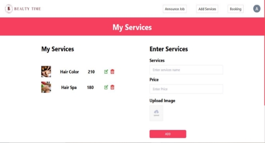
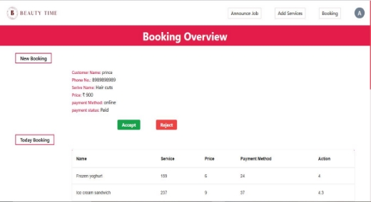
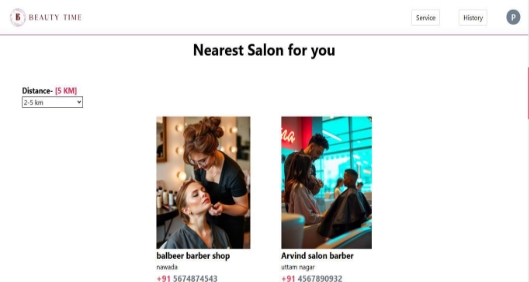
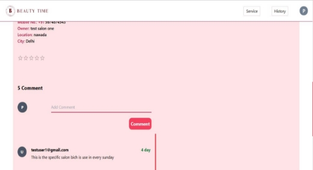
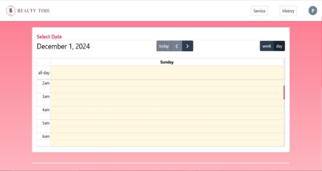
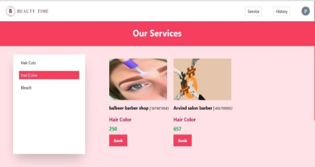
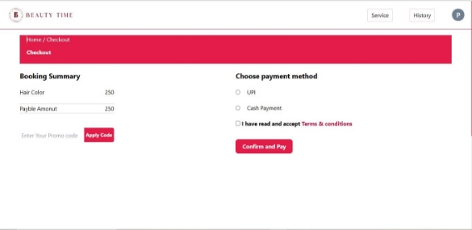
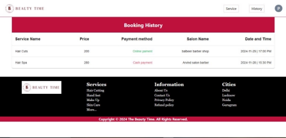

# Project: Online Salon Appointment Booking App 

# Abstract:

The  "Online  Salon  Appointment  Booking  App"  is  a  comprehensive  application designed to streamline the salon appointment booking process. This app provides a user-friendly platform for customers to book appointments online, view available time slots, and receive confirmations. The system also benefits salon owners by efficiently managing  appointments,  reducing  no-shows,  and  enhancing  overall  customer experience. 

# Problem Statement

- **Salon Market is very unorganized in India.. almost 90-95% salon Market in India is not connected with technology** 

  The Indian salon industry has seen impressive growth over the past few years, with the number of salons and beauty and personal care service providers increasing rapidly. According to a recent report, the Indian salon industry was valued at approximately INR 90,000 crore in 2020 and is expected to reach INR 1.75 trillion by 2026, growing at a CAGR of 15% from 2021 to 2026. This growth is being driven by many factors, including the increasing popularity of beauty and personal care services, the growth of the e-commerce sector, and the growing use of social media to promote beauty and personal care products and services.  

# Project Methodology 

Creating a full-fledged online booking app for salons using React JS, Express, Node.js, and MongoDB is a complex project that involves multiple components.  

1. **Project Setup:** 
- Set  up  a  new  ReactJS  project  via  react  vite for  the  client-side  of  your application. 
- Create a new Express.js project for the server-side. 
- Set up a MongoDB database to store salon and appointment data. 
2. **User Authentication:** 
- Implement user authentication for customers, salon owners. 
- Use technologies like JWT (JSON Web Token) for authentication. 

**4. Booking System:** 

- Create a booking system where customers can view available time slots and book appointments. 
- Implement a calendar for salons to manage their schedules. 

**7. Ratings and Reviews:** 

- Allow customers to leave ratings and reviews for salons  
- Display these ratings to help customers make informed decisions. 

**10. Dashboard for Business Owners:** 

- Create dashboards for salon owners and customers to manage appointments, view earnings, and monitor customer feedback. 
12. **Testing and Quality Assurance:** 
- Ensure cross-browser and cross-device compatibility. 
13. **Deployment:** 
- Deploy the React jS frontend and Express backend to hosting services. 

# 1.Web App for Salon

If a salon is registered and logged in, it can perform the following actions: 

1. Add products to its salon. 
1. Delete products. 
1. Edit product details (only the price). 
1. Post job openings to hire artists. 
1. View and edit its own profile." 

If a salon is logged in and it is not register, then it can perform the following actions: 1.Only it Access registered salon .

- A Registration Page for Salon where salon can register itself. input fields will be Salon      Name, Salon Type, Address, email id, contact number and set Password 

and confirm password.

![ref1]

**(Sign up page)** 

![ref2]

**(Sign In page)** 

- salon can add list of services which will be shown to customers 

  

- Salon can accept or cancel Booking slot requested by customer  

  

**(Not yet functioning)** 

- salon can upload timing will be shown to customer 
- Salon can upload salon photos and videos and work and customers can see. 

# 2.Web App for Customer 

- Customers can register themselves with information like Name, Address, contact number, email id, gender and Set Password. 

![ref1]

**(Sign up page)** 

![ref2]

**(Sign In page)** 

- Can search Salon with given range 

- Can give rating to Salon based on experience in Salon 

- can request for Quote to Salon for service going to Avail   
- can book appointment with timeslot and date based on salon/Artist availability  

  

- Compare salon and Price. 

  

- Can payment via two method(Cash less or with Cash) 

- Can Access own Booking Histroy. 

# Summary of this project:

This project features a two-panel architecture designed to cater to two user roles: Users and Salons. 

**User Panel:** 

- **Role:** Users can browse salons and services, book appointments, and provide feedback. 
- **Features:** 
1. Salon Booking: Users can browse and book services offered by nearby salons. 
1. Ratings and Reviews: Users can leave comments and rate salons based on their experience. 
1. Appointment Management: Users can view and manage their booked appointments. 

**Salon Panel:** 

- **Role**: Salons can manage their services and job postings after proper registration. 
- **Features**: 
1. **Conditional Access**: 
   1. If logged in but not registered, salons cannot perform CRUD operations or access additional features. 
   1. Full functionality is available only after login and registration. 
1. **Service Management**: Add, edit (price only), or delete services. 
1. **Job Posting**: Post job openings to hire professionals. 
1. **Booking Management**: View upcoming bookings from users. 

# Link:

## Repository:

**Frontend:   [ https://github.com/prince73100/salon-booking- services/tree/main/beautySalonFrontend** ](https://github.com/prince73100/salon-booking-services/tree/main/beautySalonFrontend)**

**Backend :  [** https://github.com/prince73100/salon-booking- services/tree/main/beautySalonBackend ](https://github.com/prince73100/salon-booking-services/tree/main/beautySalonBackend)**

**Deployment Link:[** https://beautytime-eta.vercel.app/ ](https://beautytime-eta.vercel.app/)

# Command:

## React + Vite:

`    `**Start**:  npm run dev 

`    `**Build**:  npm run build  

## Node Server:

`  `**Start:** npm run start 

# Instructions:

**Note**:  After clicking on the link, please wait for a few moments for the backend server to start. This is because the application is hosted on a free platform, which may cause a slight 
delay in initialization. 

# For access:

### Login for user:

  Email id: testuser1@gmail.com 

  Password: test123** 

### Login for Salon:

#### This is for registered salon:

 Email id: arvindsalon@gmail.com    
 Password: test123 

`  `**If salon user is not register salon:** 

`  `Email id: testsalon5@gmail.com    Password: test123 

[ref1]: public/Aspose.Words.6c84407c-4266-4d8d-92d2-b040cddbe491.003.jpeg
[ref2]: public/Aspose.Words.6c84407c-4266-4d8d-92d2-b040cddbe491.004.jpeg
